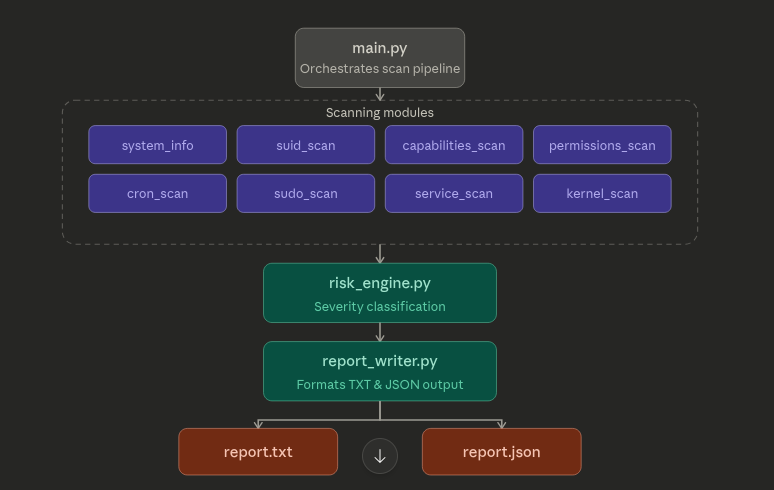

# Linux Privilege Escalation Automation Toolkit

A modular Python-based security enumeration toolkit that identifies
common Linux privilege escalation misconfigurations and produces
structured, risk-classified reports for both offensive and defensive
security workflows.

Designed for educational environments, penetration testing labs, and
security research, the toolkit automates manual enumeration steps
typically performed during the post-exploitation phase of a security
assessment.

------------------------------------------------------------------------

## Overview

Privilege escalation vulnerabilities often arise from subtle system
misconfigurations such as insecure file permissions, misconfigured sudo
rules, vulnerable cron jobs, or improperly assigned Linux capabilities.

Manual discovery of these issues is time-consuming and error-prone.

This toolkit automates the discovery process by systematically scanning
a Linux system for common escalation vectors, classifying findings based
on exploitability, and generating structured reports suitable for
remediation or further analysis.

The tool operates strictly in read-only mode and does not perform active
exploitation.

------------------------------------------------------------------------

## Key Features

-   Automated enumeration of common Linux privilege escalation vectors
-   Risk classification engine with severity-based prioritisation
-   Modular architecture for easy extension
-   Human-readable and machine-readable reports
-   Designed for Kali Linux and vulnerable lab environments such as
    Metasploitable 2
-   Lightweight and dependency minimal

------------------------------------------------------------------------

## Privilege Escalation Checks

  -----------------------------------------------------------------------
  Module                       Description
  ---------------------------- ------------------------------------------
  System Information           Collects OS version, kernel version, user
                               identity

  SUID Scan                    Identifies binaries running with elevated
                               privileges

  Linux Capabilities Scan      Detects binaries with special kernel
                               capabilities

  World Writable Files         Finds files modifiable by all users

  Cron Job Enumeration         Identifies scheduled tasks that may be
                               exploitable

  Sudo Permissions Analysis    Detects risky sudo configurations

  Service Enumeration          Lists running services that may expand
                               attack surface

  Kernel Version Check         Captures kernel version for CVE
                               correlation
  -----------------------------------------------------------------------

------------------------------------------------------------------------

## Architecture



------------------------------------------------------------------------

## Project Structure

```bash
priv-esc-toolkit/
│
├── main.py
├── requirements.txt
│
├── core/
│   ├── risk_engine.py
│   └── report_writer.py
│
├── modules/
│   ├── system_info.py
│   ├── suid_scan.py
│   ├── capabilities_scan.py
│   ├── permissions_scan.py
│   ├── cron_scan.py
│   ├── sudo_scan.py
│   ├── service_scan.py
│   └── kernel_scan.py
│
└── reports/
    ├── report.txt
    └── report.json
```
------------------------------------------------------------------------

## Installation
```bash
git clone https://github.com/Survivor-sid/Privilege-escalation-toolkit.git

cd priv-esc-toolkit

pip install -r requirements.txt
```
------------------------------------------------------------------------

## Usage
```bash
sudo python main.py
```
Reports are generated automatically in:

reports/report.txt reports/report.json

------------------------------------------------------------------------

## Severity Classification Model

  Severity   Description
  ---------- ----------------------------------------
  CRITICAL   Direct path to root privileges
  HIGH       Highly exploitable misconfiguration
  MEDIUM     Requires additional conditions
  LOW        Informational or hardening opportunity

------------------------------------------------------------------------

## Tested Environments

-   Kali Linux
-   Metasploitable 2
-   VirtualBox lab setup

------------------------------------------------------------------------

## Ethical Use Disclaimer

This tool is intended for:

-   educational use
-   authorised penetration testing
-   lab environments
-   security research

Do not use this tool on systems without explicit permission.

------------------------------------------------------------------------
